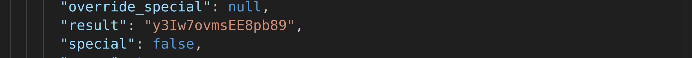
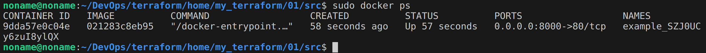
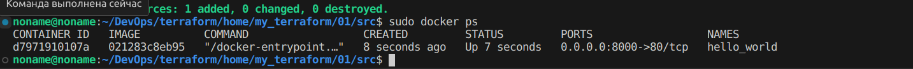
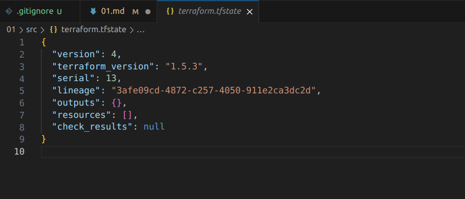

1. Перейдите в каталог src. Скачайте все необходимые зависимости, использованные в проекте.

2. Изучите файл .gitignore. В каком terraform файле согласно этому .gitignore допустимо сохранить личную, секретную информацию?

    - Согласно данному юашешптщку секретную информацию допустимо хранить в personal.auto.tfvars

3. Выполните код проекта. Найдите в State-файле секретное содержимое созданного ресурса random_password, пришлите в качестве ответа конкретный ключ и его значение.

4. Раскомментируйте блок кода, примерно расположенный на строчках 29-42 файла main.tf. Выполните команду terraform validate. Объясните в чем заключаются намеренно допущенные ошибки? Исправьте их.

    - В resource "docker_image" отсутствовал второй аргумент в названии, а в resource "docker_container" в названии стояла цыфра, что недопустимо. Также в в resource "docker_container" "nginx" в name неверно увказано име ресурса resource "random_password" "random_string".

5. Выполните код. В качестве ответа приложите вывод команды docker ps.

    

6. Замените имя docker-контейнера в блоке кода на hello_world. Не перепутайте имя контейнера и имя образа. Мы все еще продолжаем использовать name = "nginx:latest"! Выполните команду terraform apply -auto-approve. Объясните своими словами, в чем может быть опасность применения ключа -auto-approve ? В качестве ответа дополнительно приложите вывод команды docker ps

    

    - Опасность применения ключа -auto-approve заключается в том, что в случае, если допущена ошибка, terraform не отобразит список применяемых изменений.

7. Уничтожьте созданные ресурсы с помощью terraform. Убедитесь, что все ресурсы удалены. Приложите содержимое файла terraform.tfstate.

    

8. Объясните, почему при этом не был удален docker образ nginx:latest ?

    - Когда мы выполняем комнду terraform destroy удаляется созданная инфраструктура, включая docker-контейнеры. Однака образ сохраняется в  виду того, что с одного образа может быть запущено множество контейнеров и не все контейнеры, работающие с этого образа могут быть описаны в terraform.