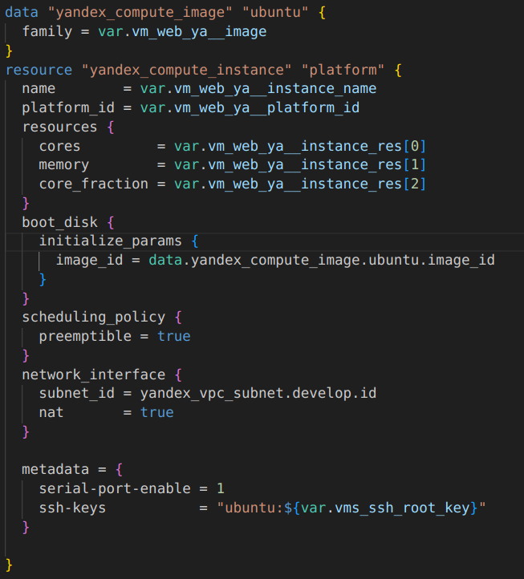

**Задание 1**

1. Изучите проект. В файле variables.tf объявлены переменные для yandex provider.
2. Переименуйте файл personal.auto.tfvars_example в personal.auto.tfvars. Заполните переменные (идентификаторы облака, токен доступа). Благодаря .gitignore этот файл не попадет в публичный репозиторий. Вы можете выбрать иной способ безопасно передать секретные данные в terraform.
3. Сгенерируйте или используйте свой текущий ssh ключ. Запишите его открытую часть в переменную vms_ssh_root_key.
4. Инициализируйте проект, выполните код. Исправьте намеренно допущенные синтаксические ошибки. Ищите внимательно, посимвольно. Ответьте в чем заключается их суть?
5. Ответьте, как в процессе обучения могут пригодиться параметрыpreemptible = true и core_fraction=5 в параметрах ВМ? Ответ в документации Yandex cloud.

    - Параметр preemptible = true - делает ВМ прерываемой, а параметр core_fraction=5 позволяет задать уровень производительности vCPU. В процессе обучения это           может пригодиться, для того чтобы уменьшить расход предоставленного дипозита.

2. **Задание 2**

1. Изучите файлы проекта.
2. Замените все "хардкод" значения для ресурсов yandex_compute_image и yandex_compute_instance на отдельные переменные. К названиям переменных ВМ добавьте в начало префикс vm_web_ . Пример: vm_web_name.
3. Объявите нужные переменные в файле variables.tf, обязательно указывайте тип переменной. Заполните их default прежними значениями из main.tf.
4. Проверьте terraform plan (изменений быть не должно).

    - Команда terraform plan показывает отсутствие изменений.

3. **Задание 3**

1. Создайте в корне проекта файл 'vms_platform.tf' . Перенесите в него все переменные первой ВМ.
2. Скопируйте блок ресурса и создайте с его помощью вторую ВМ(в файле main.tf): "netology-develop-platform-db" , cores = 2, memory = 2, core_fraction = 20. Объявите ее переменные с префиксом vm_db_ в том же файле('vms_platform.tf').
3. Примените изменения.

4. **Задание 4**

1. Объявите в файле outputs.tf output типа map, содержащий { instance_name = external_ip } для каждой из ВМ.
2. Примените изменения.

5. **Задание 5**

1. В файле locals.tf опишите в одном local-блоке имя каждой ВМ, используйте интерполяцию ${..} с несколькими переменными по примеру из лекции.
2. Замените переменные с именами ВМ из файла variables.tf на созданные вами local переменные.
3. Примените изменения.

    - Файл locals.tf :

    

    - Файл main.tf:

    

    

    - Полный репозиторий проекта находится по ссылке:

    https://github.com/Milks-Way/my_terraform/tree/main/02

6. **Задание 6**

1. Вместо использования 3-х переменных ".._cores",".._memory",".._core_fraction" в блоке resources {...}, объедените их в переменные типа map с именами "vm_web_resources" и "vm_db_resources". В качестве продвинутой практики попробуйте создать одну map переменную vms_resources и уже внутри нее конфиги обеих ВМ(вложенный map).
2. Так же поступите с блоком metadata {serial-port-enable, ssh-keys}, эта переменная должна быть общая для всех ваших ВМ.
3. Найдите и удалите все более не используемые переменные проекта.
4. Проверьте terraform plan (изменений быть не должно).

7. **Дополнительные задания (со звездочкой*) Задание 7**
    
Изучите содержимое файла console.tf. Откройте terraform console, выполните следующие задания:

1. Напишите, какой командой можно отобразить второй элемент списка test_list?
2. Найдите длину списка test_list с помощью функции length(<имя переменной>).
3. Напишите, какой командой можно отобразить значение ключа admin из map test_map ?
4. Напишите interpolation выражение, результатом которого будет: "John is admin for production server based on OS ubuntu-20-04 with X vcpu, Y ram and Z virtual disks", используйте данные из переменных test_list, test_map, servers и функцию length() для подстановки значений.

Ответ:

1. local.test_list[1]
2. length(local.test_list)
3. local.test_map["admin"]
4. "${local.test_map["admin"]} is admin for ${local.test_list[2]} server based on OS ${local.servers.production["image"]} with ${local.servers.production["cpu"]} vcpu, ${local.servers.production["ram"]} ram and ${length(local.servers.production["disks"])}  virtual disks"
