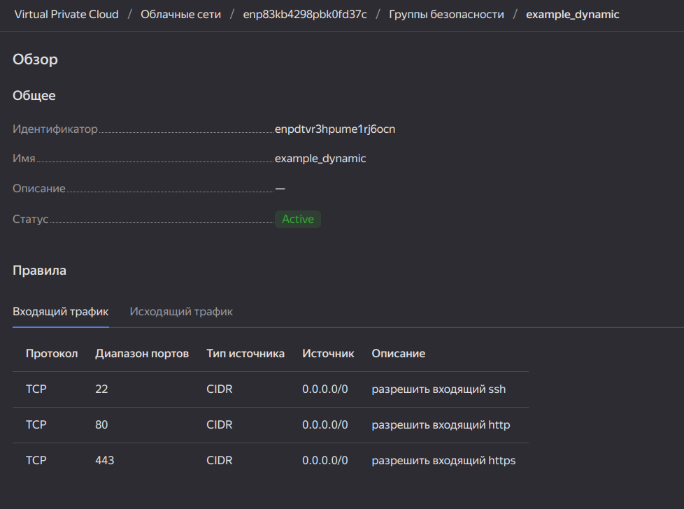
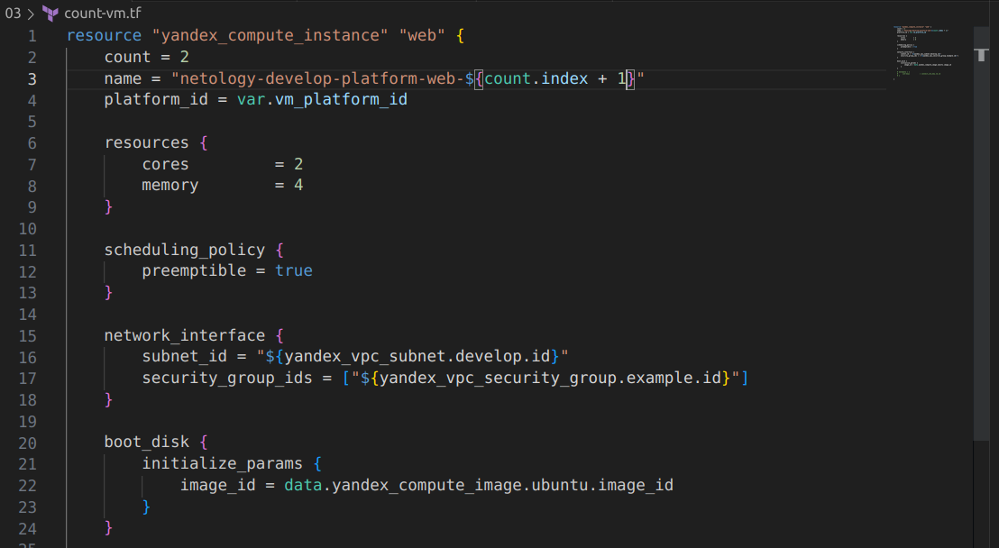
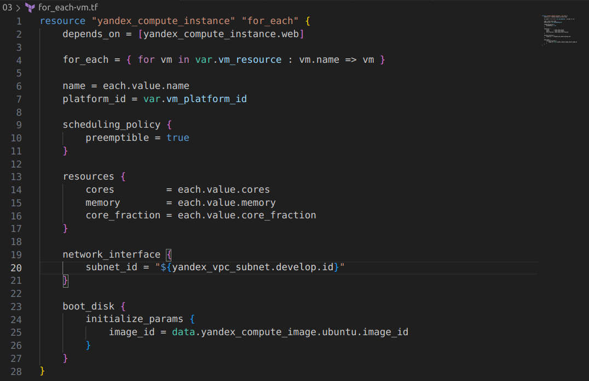
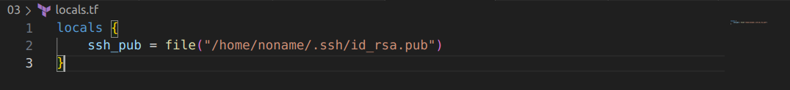
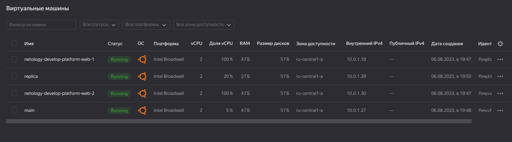
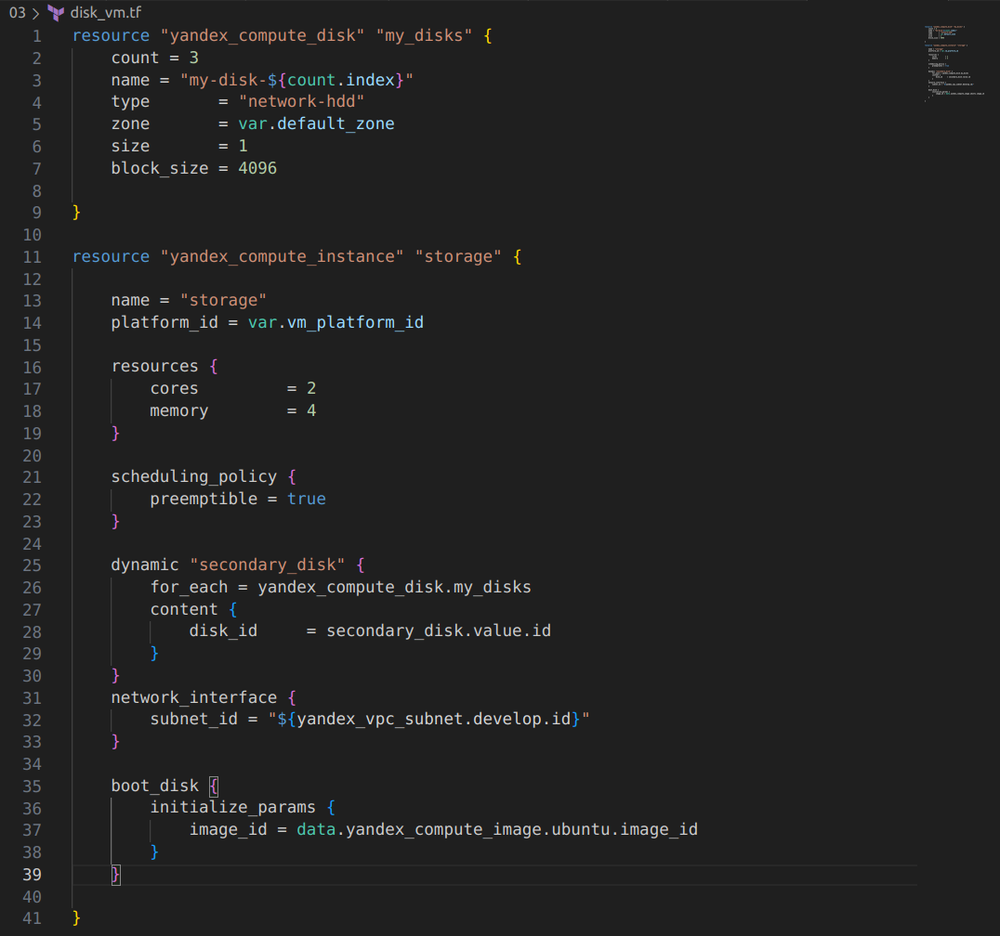
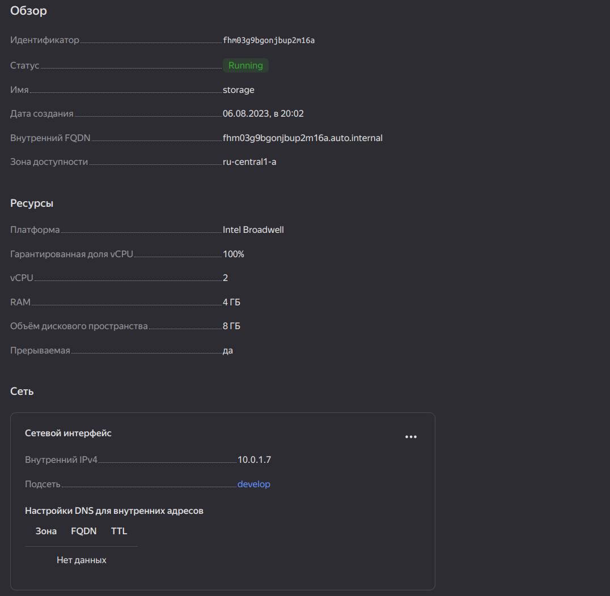
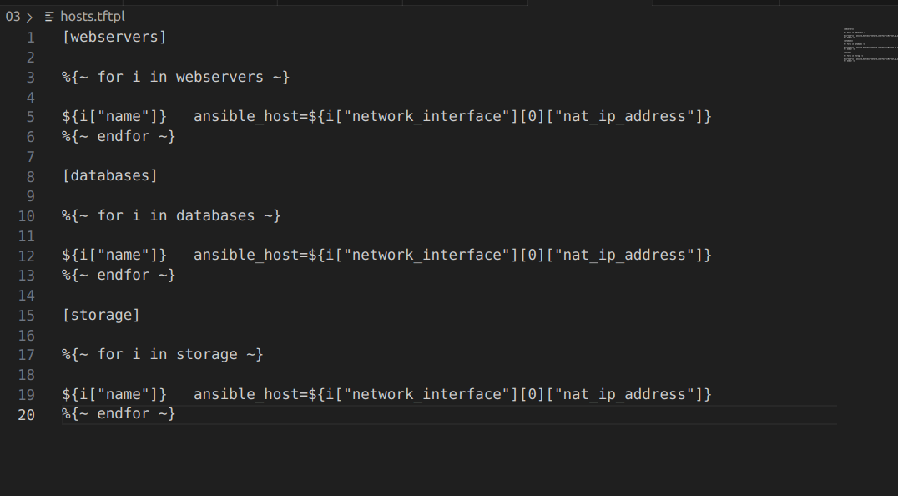
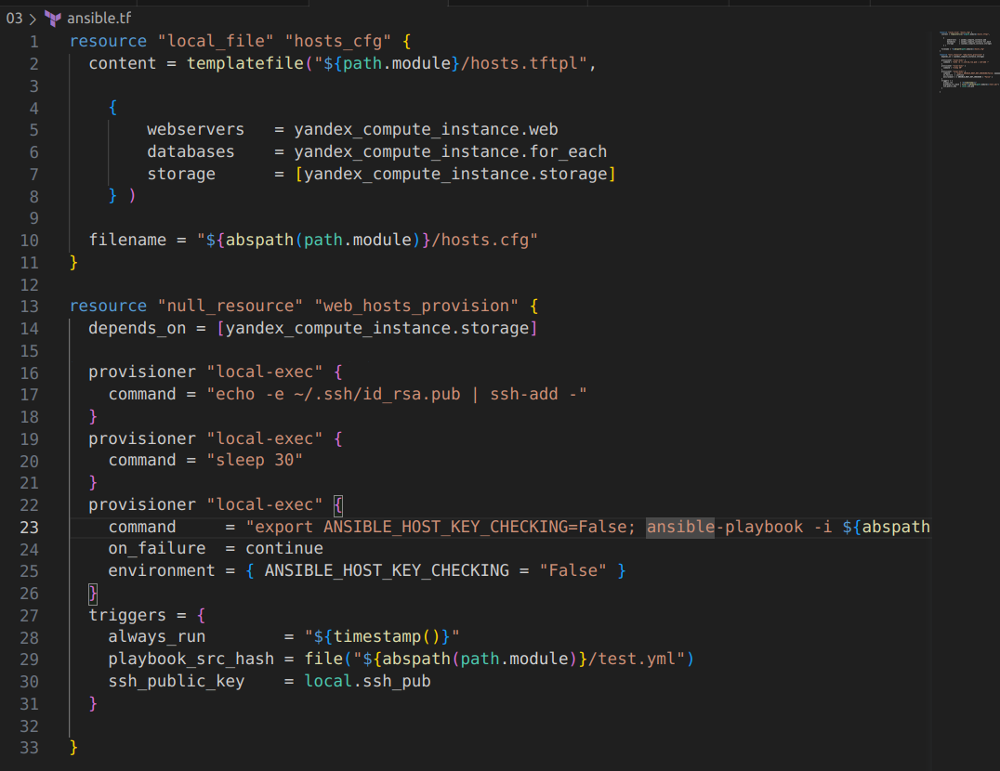

**Задание 1**
1.Изучите проект.
2.Заполните файл personal.auto.tfvars.
3.Инициализируйте проект, выполните код. Он выполнится, даже если доступа к preview нет.

**Задание 2**

1.Создайте файл count-vm.tf. Опишите в нём создание двух одинаковых ВМ web-1 и web-2 (не web-0 и web-1) с минимальными параметрами, используя мета-аргумент count loop. Назначьте ВМ созданную в первом задании группу безопасности.(как это сделать узнайте в документации провайдера yandex/compute_instance)

2.Создайте файл for_each-vm.tf. Опишите в нём создание двух ВМ с именами "main" и "replica" разных по cpu/ram/disk , используя мета-аргумент for_each loop. Используйте для обеих ВМ одну общую переменную типа list(object({ vm_name=string, cpu=number, ram=number, disk=number })). При желании внесите в переменную все возможные параметры.

3.ВМ из пункта 2.2 должны создаваться после создания ВМ из пункта 2.1.

    Для выполнения этого пункта используется "depends_on"

4.

5.Инициализируйте проект, выполните код.

**Задание 3**

1.Создайте 3 одинаковых виртуальных диска размером 1 Гб с помощью ресурса yandex_compute_disk и мета-аргумента count в файле disk_vm.tf.

2.Создайте в том же файле одну ВМ c именем "storage" . Используйте блок dynamic secondary_disk{..} и мета-аргумент for_each для подключения созданных вами дополнительных дисков.

**Задание 4**

1.В файле ansible.tf создайте inventory-файл для ansible. Используйте функцию tepmplatefile и файл-шаблон для создания ansible inventory-файла из лекции. Готовый код возьмите из демонстрации к лекции demonstration2. Передайте в него в качестве переменных группы виртуальных машин из задания 2.1, 2.2 и 3.2, т. е. 5 ВМ.
2.Инвентарь должен содержать 3 группы [webservers], [databases], [storage] и быть динамическим, т. е. обработать как группу из 2-х ВМ, так и 999 ВМ.

3.Выполните код. Приложите скриншот получившегося файла.

